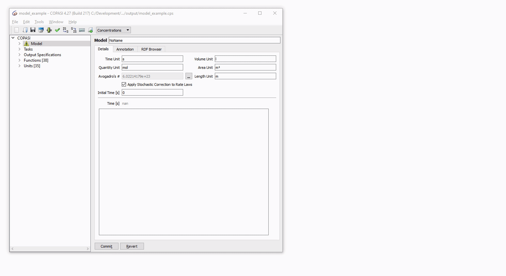

## EnzymeML -> COPASI importer
This project hosts a python importer that takes an EnzymeML archive, and generates a COPASI Model along with the transformed experimental data out of it. The data will be mapped to the model entities in question. 

From this point on you could open the resulting file in COPASI, select a candidate kinetic law from the function database (or enter your own). Once done you can let the kinetic parameters estimated by COPASI. 

### Setup
The best thing to do, is to create a new virtual environment and simply 
install the requirements directly using `pip install -r requirements.txt`. 

### Usage
To use the importer from the command line you would simply run: 

    python enzymeml_importer.py <enzyme ml archive> <output dir>
    
This will convert the provided `enzyme ml archive` to a COPASI file and an experimental data file in the provided `output dir`. 

This COPASI file can then be loaded into COPASI, the corresponding kinetic specified, 
and a parameter estimation carried out. Here an example of how that could look like (using the provided example output file): 

### EnzymeML
EnzymeML is an open interchange format for enzyme kinetics, it is an SBML based dialect, includes measurements as TSV files, and is shipped as COMBINE archive. More information about EnzymeML can be found: 

* at its [fairdomhub organization](https://fairdomhub.org/programmes/66)
* the [github organization](https://github.com/EnzymeML)

### License
Just as COPASI, the packages available on this page are provided under the 
[Artistic License 2.0](http://copasi.org/Download/License/), 
which is an [OSI](http://www.opensource.org/) approved license. This license 
allows non-commercial and commercial use free of charge.
